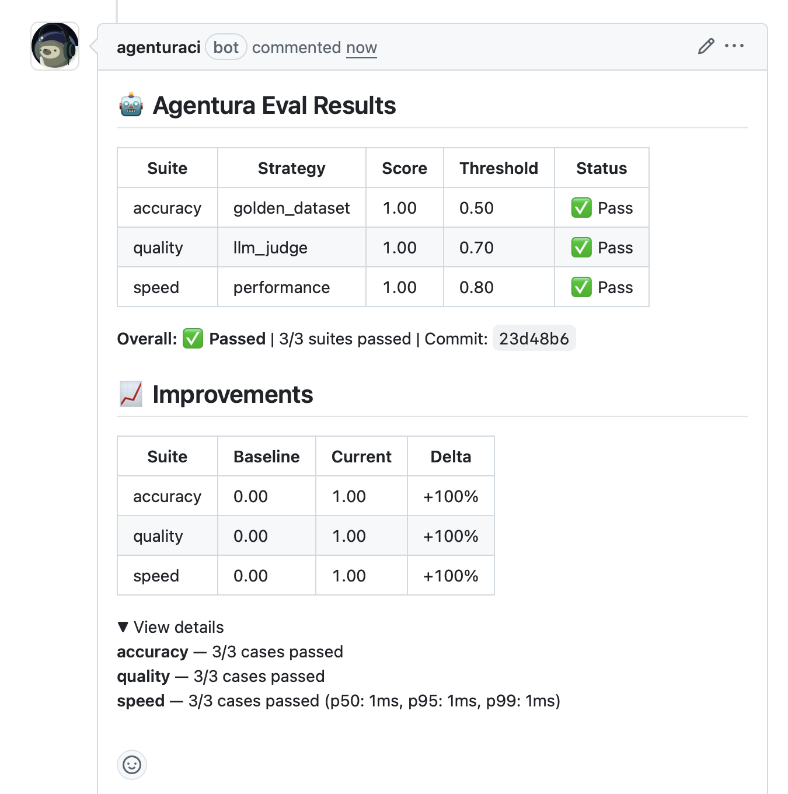

# Agentura

Automated eval checks for every PR — no code changes required.

## What it does

- Runs your eval suite on every PR automatically
- Posts results as a PR comment and GitHub Check
- Catches regressions before they reach production

## Demo



## Quick Start

1. Install the GitHub App → <https://github.com/apps/agenturaci/installations/new>
2. Add `agentura.yaml` to your repo root
3. Add your eval dataset
4. Open a PR
5. See results in the PR comment

Full guide: [docs/quickstart.md](docs/quickstart.md)

## Installation

```bash
npm install -g agentura
```

Then:

```bash
agentura login
agentura init
agentura run
```

## How it works

PR opened → GitHub webhook → Agentura worker → Runs eval suites → Posts PR comment + Check Run → Dashboard shows trend over time

## Eval Strategies

| Strategy | Use case | Example |
|---|---|---|
| `golden_dataset` | Exact/fuzzy match | Q&A accuracy |
| `llm_judge` | Subjective quality | Tone, helpfulness |
| `performance` | Latency tracking | Response time |

## Configuration

```yaml
version: 1

agent:
  type: http
  endpoint: https://your-agent.example.com/api/agent
  timeout_ms: 10000

evals:
  - name: accuracy
    type: golden_dataset
    dataset: ./evals/accuracy.jsonl
    scorer: exact_match
    threshold: 0.8

ci:
  block_on_regression: false
  compare_to: main
  post_comment: true
```

## Self-hosting

Agentura is open source. See `docs/self-hosting.md` to run your own instance.

## License

MIT
